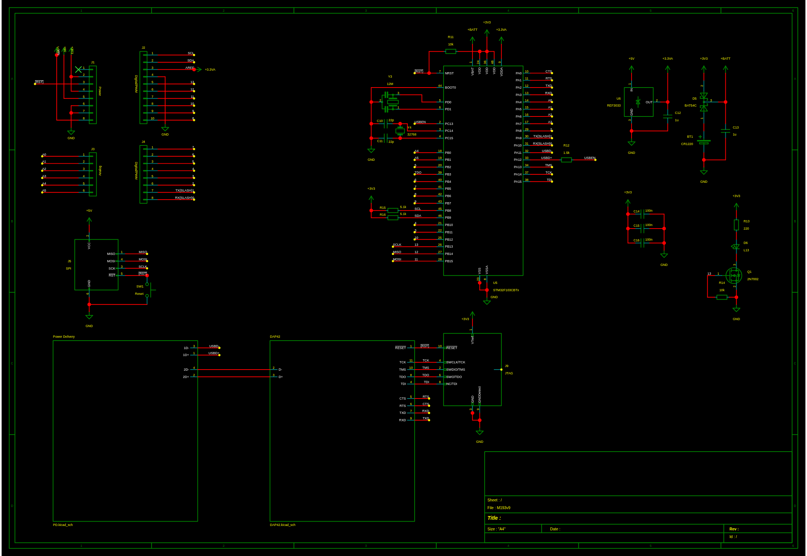
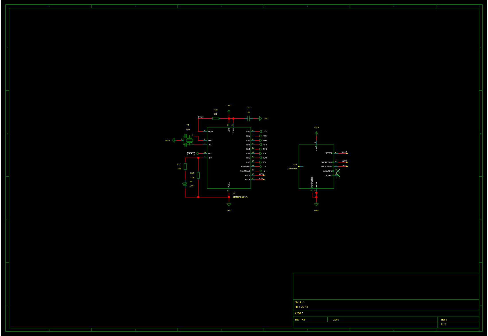
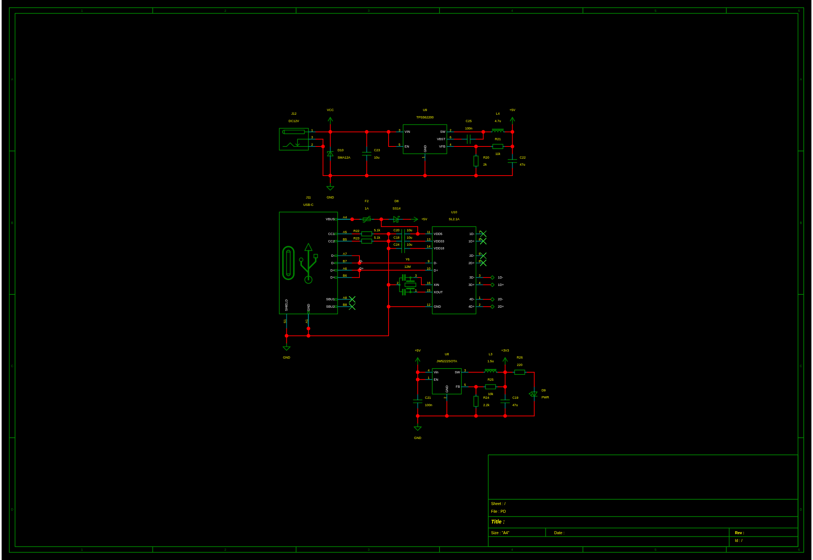
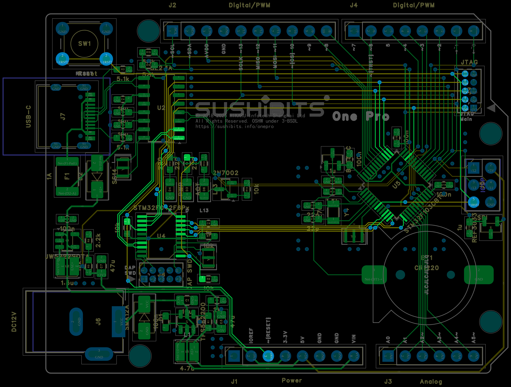

# CORAL-DAP

一个基于我朋友设计的 **STM32F103** 开发板上的 **STM32F042** 的实验性 **CMSIS-DAP v1 (USB HID)** 调试探针项目。

> 当前定位：**已在配套硬件上完成 STM32F103CB 连接、读写和烧录验证的 CMSIS-DAP bring-up / 学习项目**
>
> 它的目标不是完整复刻官方 DAPLink，而是在资源有限的 STM32F042 上，
> 尝试实现一个可以被主机识别的 **CMSIS-DAP HID probe**，并通过 GPIO bit-bang 的方式驱动 SWD。

---

## 项目简介

这个仓库最初是一个 STM32CubeMX 生成的 STM32F042 工程，后续逐步加入了：

- USB Custom HID 设备描述符
- 最小 CMSIS-DAP v1 命令集
- 基于 GPIO 的 SWD bit-bang
- 目标 `nRESET` 控制
- 用于 OpenOCD 的简单配置文件

当前代码更适合以下用途：

- 学习 CMSIS-DAP / SWD 的基础机制
- 研究 USB HID 枚举与主机识别流程
- 作为后续自定义调试探针固件的起点
- 记录一次“从零 bring-up 一个 CMSIS-DAP probe”的尝试

---

## 当前状态

### 已完成

- [x] 工程可基于 CMake / STM32CubeMX 结构构建
- [x] USB 以 HID 设备方式枚举
- [x] 主机侧可识别为 CMSIS-DAP 设备
- [x] `pyocd list` 可以识别 probe
- [x] `openocd` 可以识别 probe 并初始化 CMSIS-DAP 接口
- [x] 已实现基础 CMSIS-DAP v1 命令路径
- [x] 已加入目标 `nRESET` 控制
- [x] 已验证读取 STM32F103CB 的 DPIDR、CPUID、DBGMCU ID 和 Flash 容量
- [x] 已验证 OpenOCD 擦除、烧录、读回校验、复位和断点控制
- [x] 已修正 SWD ACK 相位、turnaround、AP posted read 和 `DAP_TransferBlock`
- [x] 附带并实机验证 `F103_Blinky` 闪灯示例

### 当前限制

- [ ] **不是完整 DAPLink**
- [ ] **只声明并验证了 SWD，不提供 JTAG/SWO**
- [ ] **不包含 MSC/U 盘拖拽烧录**
- [ ] **不包含 CDC 虚拟串口**
- [ ] **GPIO bit-bang 有效时钟上限限制为 1 MHz，推荐从 100 kHz 开始**
- [ ] **目前的实机验证对象是配套 STM32F103CB 板，不保证与所有目标板和主机工具兼容**

如果你正在寻找一个“开箱即用、生产可用”的 DAPLink 固件，这个仓库并不是那个目标。

---

## 这是什么 / 这不是什么

### 这是

- 一个 **STM32F042 + USB HID + SWD bit-bang** 的实验项目
- 一个 **最小 CMSIS-DAP v1** 的实现尝试
- 一个偏向学习和记录过程的仓库

### 这不是

- 不是官方 Arm DAPLink
- 不是完整的 CMSIS-DAP 固件发行版
- 不是生产级调试器
- 不是“拖拽烧录器 + 串口 + 调试器”三合一方案

---

## 硬件说明

### 主控

- **STM32F042**

### 当前引脚定义

| 功能 | 引脚 |
|---|---|
| LED | `PB8` |
| SWDIO / TMS | `PA4` |
| SWCLK / TCK | `PA5` |
| TDO | `PA6` |
| TDI | `PA7` |
| Target nRESET | `PB1` |

> 注：
>
> - 当前实现主要走 **SWD**，因此真正关键的是：
>   - `PA4` -> 目标 `SWDIO`
>   - `PA5` -> 目标 `SWCLK`
>   - `PB1` -> 目标 `NRST`
>   - `GND` -> 目标 `GND`
> - `PA6 / PA7` 主要保留给 JTAG 风格引脚命名或扩展实验，并不是当前 SWD bring-up 的核心路径。

---

## 项目结构

```text
.
├── Core/
│   ├── Inc/
│   └── Src/
├── Drivers/
├── Middlewares/
│   └── ST/STM32_USB_Device_Library/
├── USB_DEVICE/
│   ├── App/
│   │   ├── usb_device.c
│   │   ├── usbd_desc.c
│   │   └── usbd_custom_hid_if.c
│   └── Target/
├── cmake/
│   └── stm32cubemx/
├── F103_Blinky/
│   ├── main.c
│   ├── startup_stm32f103cb.s
│   ├── STM32F103CB_FLASH.ld
│   └── CMakeLists.txt
├── STM32F042XX_FLASH.ld
├── CMakeLists.txt
└── daplink.cfg
```

---

## 核心实现说明

### 1. USB HID 设备

项目使用 STM32 USB Device Library 的 **Custom HID** 类实现 USB 通讯。

当前实现采用：

- **64-byte IN / 64-byte OUT** vendor HID report
- 通过 HID 传输 CMSIS-DAP v1 命令包

### 2. CMSIS-DAP 协议

当前代码实现了一个可供 OpenOCD 使用的 CMSIS-DAP v1 命令路径，包含但不限于：

- `DAP_Info`
- `DAP_Connect`
- `DAP_Disconnect`
- `DAP_SWJ_Pins`
- `DAP_SWJ_Clock`
- `DAP_SWJ_Sequence`
- `DAP_SWD_Configure`
- `DAP_TransferConfigure`
- `DAP_Transfer`
- `DAP_TransferBlock`
- `DAP_ResetTarget`

### 3. SWD 实现方式

当前 SWD 并不是使用专用调试外设，而是：

- 使用 GPIO 模拟 `SWDIO` / `SWCLK`
- 手动处理：
  - line reset
  - turnaround
  - ACK 读取
  - 数据读写
  - parity

因此它本质上是一个 **bit-bang SWD** 实现。

本次修复重点包括：

- 让每个 SWD bit 的周期结束于 SWCLK 高电平，目标在正确边沿返回 ACK
- 在 turnaround 完成后再切换 SWDIO 输出方向，避免主机与目标争用总线
- 正确处理 WAIT / FAULT、data phase、parity、idle cycles 和写入 flush
- 正确实现 AP posted read，并通过 DP `RDBUFF` 取回最后一个 AP 结果
- 修正 `DAP_TransferBlock` 的包字段偏移和单包边界
- 修正 HID report descriptor 的实际长度，避免 Windows HID Code 10
- 避免在 USB 中断回调中调用 `HAL_Delay`

---

## 构建

### 环境要求

推荐使用：

- STM32CubeCLT / GNU Arm Embedded Toolchain
- CMake >= 3.22
- Ninja（可选）
- CLion / VSCode / 命令行均可

### 构建示例

```bash
cmake --preset Release
cmake --build --preset Release
```

> 说明：
>
> STM32F042 的 Flash 很紧张，建议优先使用 `Release` 或体积优化配置构建。
> Debug 配置下可能更容易遇到空间不足。

生成文件位于 `build/Release/coral-dap.elf`。

### 构建 STM32F103CB 闪灯示例

确保 `arm-none-eabi-gcc`、CMake 和 Ninja 已加入 `PATH`：

```bash
cmake -S F103_Blinky -B build/F103_Blinky -G Ninja \
  -DCMAKE_TOOLCHAIN_FILE=gcc-arm-none-eabi.cmake \
  -DCMAKE_BUILD_TYPE=Release
cmake --build build/F103_Blinky
```

示例使用复位后的 8 MHz HSI 和 SysTick，每 500 ms 翻转一次 `PB13`。原理图中 `PB13` 通过 Q1（2N7002）驱动 D6/L13，因此高电平点亮 LED。

---

## 烧录

### 使用外部 CMSIS-DAP 烧录 STM32F042

`daplink.cfg` 可以通过 `DAP_TARGET=f042` 切换到 F042。只有一个 CMSIS-DAP 时可省略 `DAP_SERIAL`：

```bash
openocd \
  -c "set DAP_TARGET f042" \
  -c "set DAP_SERIAL <external-probe-serial>" \
  -f daplink.cfg \
  -c "program build/Release/coral-dap.elf verify reset exit"
```

### 使用板载 F042 DAP 烧录 STM32F103CB

默认目标就是 F103：

```bash
openocd -f daplink.cfg \
  -c "program build/F103_Blinky/f103_blinky.elf verify reset exit"
```

---

## 主机侧验证

### 1. 检查 USB 枚举

```bash
lsusb
sudo lsusb -v -d <VID:PID>
```

### 2. 检查 pyOCD 识别

```bash
pyocd list
```

### 3. 检查 OpenOCD 识别

```bash
openocd -f daplink.cfg \
  -c "init; reset halt; mdw 0xE000ED00 1; mdw 0xE0042000 1; mdh 0x1FFFF7E0 1; shutdown"
```

配套 STM32F103CB 实机验证结果：

- F042 probe firmware：`0.3`
- SWD DPIDR：`0x1BA01477`
- Cortex-M3 CPUID：`0x411FC231`
- DBGMCU IDCODE：`0x20036410`
- Flash size：`0x0080`，即 128 KiB

---

## `daplink.cfg`

仓库附带的 `daplink.cfg` 同时支持两个工作流：

- 默认：使用板载 F042 CMSIS-DAP 调试/烧录 STM32F103CB，速度 100 kHz
- `DAP_TARGET=f042`：使用外部 CMSIS-DAP 烧录 STM32F042，速度 1 MHz

示例：

```bash
openocd -f daplink.cfg
```

---

## 已知问题

- 其他目标板上的 SWD 稳定性仍依赖：
  - 目标板实际硬件连接
  - `nRESET` 控制
  - 目标板当前固件是否关闭 SWD/JTAG
  - bit-bang 时序是否合适
- 主机请求超过 1 MHz 时，当前固件会把 GPIO bit-bang 有效时钟限制在 1 MHz
- 目前未实现 SWO、JTAG、CMSIS-DAP packet queue、MSC 和 CDC
- 该项目更适合学习与实验，不适合直接作为生产工具使用

---

## 后续可改进方向

如果未来继续推进，这个项目可以往这些方向演进：

- [ ] 继续提升高速 SWD 时序稳定性
- [ ] 适配更多目标 MCU
- [ ] 增加更可靠的 `nRESET` / connect-under-reset 流程
- [ ] 补充串口日志或调试输出
- [ ] 优化 Flash 占用
- [ ] 增加更完整的 CMSIS-DAP 命令覆盖
- [ ] 评估是否迁移到更大容量 MCU

---

## 原理图





---

## PCB


---

## 适合谁阅读这个仓库

这个仓库更适合：

- 想了解 CMSIS-DAP 基本工作方式的人
- 想自己做一个简单 SWD probe 的人
- 想研究 STM32 USB HID + bit-bang SWD 的人
- 想看一次实际 bring-up 过程的人

不太适合：

- 想直接获得稳定量产级调试器固件的人
- 想一步到位获得完整 DAPLink 功能的人

---

## 免责声明

这是一个实验性项目。

当前代码主要用于：

- 学习
- 验证
- 记录
- 继续迭代的起点

请不要将其视为已经完整验证的生产级调试器固件。

---

## License

如需开源发布，建议你根据自己的意愿补充许可证，例如：

- MIT
- BSD-3-Clause
- Apache-2.0

示例：

```text
MIT License
```

---

## 致谢
- 我的朋友天野[xcvista](https://github.com/xcvista)，是他提供的原理图和 PCB 设计让我能够快速搭建这个项目。
- STM32CubeMX / STM32 HAL
- STM32 USB Device Library
- CMSIS-DAP / Arm Debug Interface 相关公开资料
- OpenOCD / pyOCD 生态
